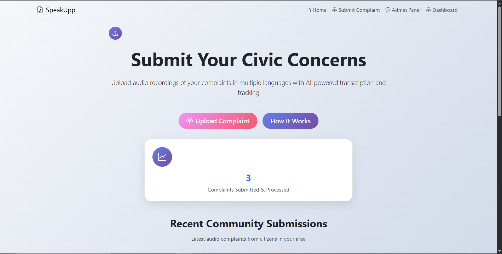
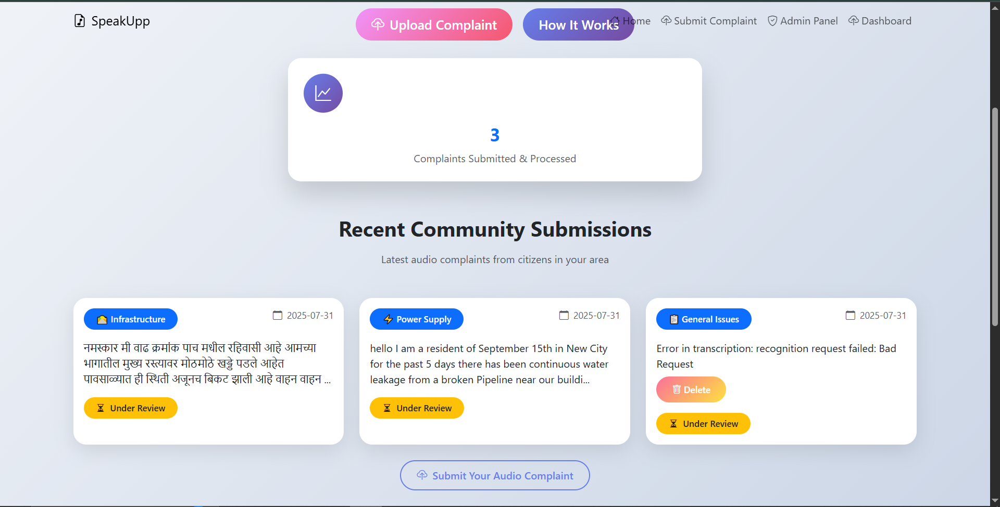

# 🗣️ Voice-to-Text Complaint System



A web application that allows users to submit complaints using their voice. The audio is transcribed to text and stored along with the audio file. Admins can log in to manage, review, and respond to complaints from a secure dashboard.

---

## 📚 Table of Contents

- [Scenario](#-scenario)
- [Features](#-features)
- [Tech Stack](#️-tech-stack)
- [Project Structure](#-project-structure)
- [Getting Started Locally](#-getting-started-locally)
- [Hosting & Deployment](#-hosting--deployment)
- [Roles](#-roles)
- [Feedback](#-feedback)
- [Notes](#notes)


## 📖 Scenario

This project simulates a complaint management system in a team-based environment where multiple admins may be operating from different locations (e.g., branch offices, campuses, or local offices).

To ensure a structured hierarchy and secure management:

- A **Superadmin** must be registered first.
- Without a Superadmin, no other admin can be registered or access the system.
- This allows central control and prevents unauthorized or premature access.
- Admins can be promoted to Superadmin only by an existing Superadmin.

This setup ensures secure bootstrapping and strict role-based access in decentralized environments.

## 🚀 Features

- 🎙️ **Voice-to-Text Complaint Submission**
  - Users record or upload an audio complaint
  - Speech is transcribed to text using speech recognition
  - Complaint is stored in MongoDB Atlas along with metadata

- 📋 **Complaint Validation**
  - If transcription fails (e.g., music file or unclear input), the user sees an error message
  - Users can **delete invalid complaints themselves** if transcription fails

- 🧑‍💼 **Admin & Superadmin Dashboard**
  - View all complaints with metadata (category, date, status)
  - Play back audio directly on the dashboard
  - Promote admins to superadmins
  - Filter complaints by category/status

  - Admin_dash
  [App Screenshot](./assets/admin_dash_admin.png)

  - Superadmin_dash
  [App Screenshot](./assets/admin_dash_superadmin.png)

- 🌐 **Public Complaint Feed**
  - Displays **5–10 most recent complaints** on the homepage
  - Each complaint card shows:
    - Category (tag)
    - Submission date
    - Audio transcription preview
    - Complaint status (e.g., `Under Review`)
    - Delete option (if failed)



- 🌓 **User Interface Enhancements**
  - Responsive layout with modern card-based UI
  - Dark/Light mode support
  - Minimalist top nav with links to:
    - Submit Complaint
    - Admin Panel
    - Dashboard


---

## 🛠️ Tech Stack

- **Frontend:** HTML5, CSS3, Basic JavaScript for Password, Bootstrap
- **Backend:** Python Flask
- **Database:** MongoDB Atlas (or local MongoDB)
- **Deployment:** Render

## 📁 Project Structure

```text
voice-to-text-complaint-system/
│
├── static/                  # CSS, JS, and audio files
├── templates/               # HTML templates
├── app.py                   # Main Flask application
├── .env                     # Environment variables
├── requirements.txt
└── README.md
```

## 🧪 Getting Started Locally

### 🔧 Prerequisites

- Python 3.8+
- MongoDB installed locally or access to MongoDB Atlas

### 🐍 Setup

1. Clone the repository:
```bash
git clone https://github.com/yourusername/vtt-complaint-system.git
cd vtt-complaint-system
```

2. Create and activate virtual environment:
```bash
python -m venv venv
source venv/bin/activate  # On Windows: venv\Scripts\activate.bat
```

3. Install dependencies:
```bash
pip install -r requirements.txt
```

4. Create `.env` file and add the following:
```env
MONGO_URI=your_local_or_atlas_mongodb_uri
SECRET_KEY=your_flask_secret_key
DATABASE_NAME=your_database_name (if using local mongodb)
```

```Alter code (if using local mongodb)
Uncomment this lines

# DATABASE = os.getenv('DATABASE')
# db = client[DATABASE]
```

5. Run the application:
```bash
python run.py
```

Visit `http://localhost:5000` to use the app.

---

## 🌍 Hosting & Deployment

- **Backend:** Hosted on [Render](https://render.com/)
- **Database:** [MongoDB Atlas](https://www.mongodb.com/cloud/atlas)
    - Free 512 MB tier for testing (~10 days usage with moderate audio & metadata storage)
    - Atlas auto-pauses during inactivity, wakes on access

> ⚠️ **Security Warning:** Avoid hardcoding credentials. Use `.env` variables and keep them secure.

To use MongoDB locally, [download and install MongoDB](https://www.mongodb.com/try/download/community), start the server, and use:
```env
MONGO_URI=mongodb://localhost:27017
```

---

## 👥 Roles

  - (When there is superadmin, then the 'Admin Panel' button shows 'Admin Setup' and when click, opens a page to register a superadmin)
- **Superadmin**
  - Can register new admins
  - Can promote admins to superadmins
  - Can delete the complaints in dashboard
- **Admin**
  - Can access complaints dashboard and manage records


## 💬 Feedback

If you have any suggestions, feel free to open an issue or reach out!


## Notes
⚠️ Important Note on Commit History
Due to a force push (git push --force) during development, all previous commits have been overwritten.
Current version is stable and complete.